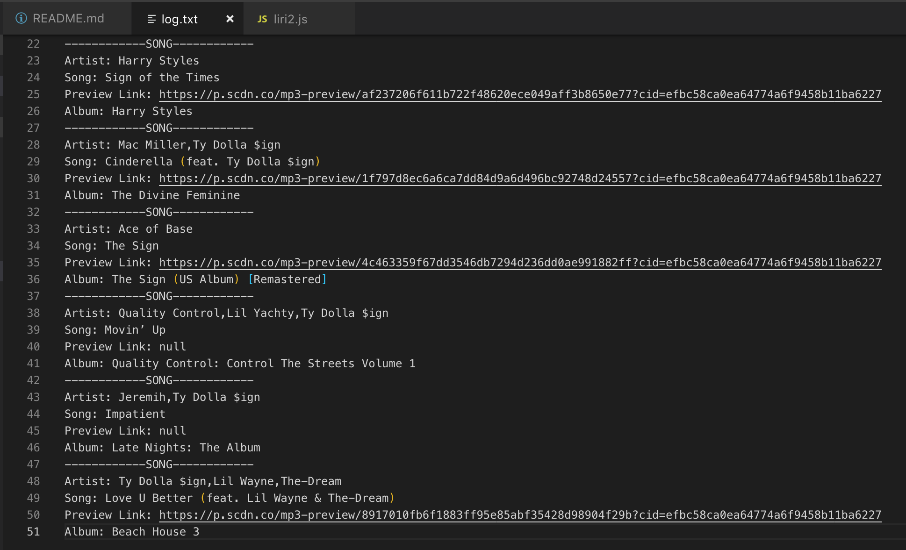

# Liri-Bot

### Overview

LIRI is a Language Interpretation and Recognition Interface. LIRI is a command line node app that takes in parameters and gives you back data.

### Commands 

There are three commands that can be used:

1. spotify-this-song
2. movie-this
3. do-what-it-says

### Using LIRI for the First Time

When using the program is used for the first time, it will create a log.txt file where all the data will be printed.

After the file is created, any subsequent terminal request will be added to the end of that file.

### Spotify This Song Command

When using this command, the first input is the command "spotify-this-song" and the second input (optional) is the song title.

The returned log.txt file will look like this:

If no song is provided, it will default to "The Sign".

The returned log.txt file will have the same output style, just with a differnt song:

### Movie This Command

When using this command, the first input is the command "movie-this" and the second input (optional) is the movie title.

The returned log.txt file will look like this:

If no movie is provided, it will default to "Mr. Nobody".

The returned log.txt file will have the same output style, just with a differnt song:

### Do What It Says Command

When using this command, the only input is the command "do-what-it-says".

This command will take the information in the "random.txt" file. The file contains either the song or the movie command with a corresponding secondary input (song or movie).

"Random.txt" file can contain a the spotify-this-song command:

Or "random.txt" file can contain a the movie-this command:

The information about the song will be returned in the log.txt file.

Or the information about the movie will be returned in the log.txt file.

